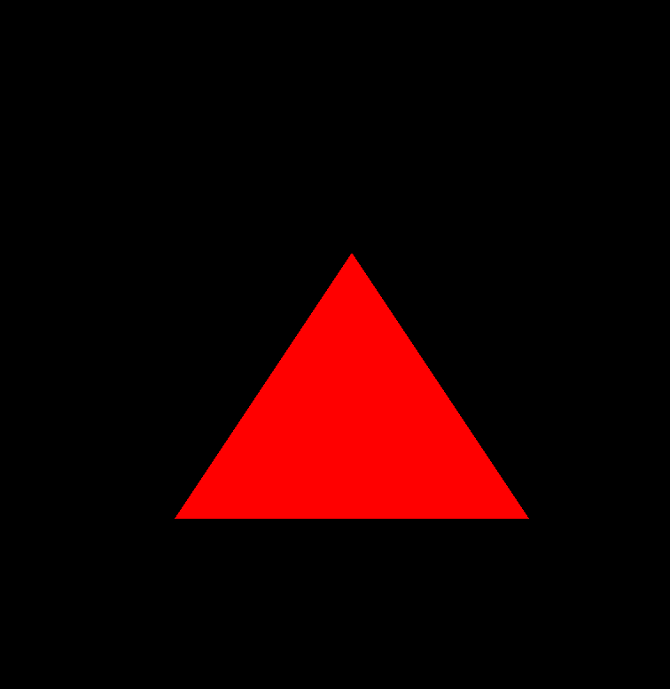

# PortableGL RTEMS Demo

A proof-of-concept demonstrating [PortableGL](https://github.com/rswinkle/PortableGL) running on [RTEMS](https://www.rtems.org/).

Demonstrates PortableGL integration with RTEMS on the i386/pc386 BSP running in QEMU. Tested on i386/pc386 only so far.

## Tests

**hello**
Verifies that portablegl.h compiles successfully under RTEMS with no rendering performed.

**hello_triangle**
Renders a triangle using PortableGL and outputs it to the RTEMS framebuffer.

## Dependencies

- [RTEMS 7](https://docs.rtems.org/) toolchain for i386
- RTEMS pc386 BSP built with POSIX API support
- QEMU

## Building

```bash
git submodule init
git submodule update

export RTEMS_MAKEFILE_PATH=<your_prefix>/i386-rtems7/pc386

make
```

## Running

**hello**

```
qemu-system-i386 -m 128 -no-reboot -append \
  "--video=off --console=/dev/com1" -nographic \
  -kernel tests/hello/o-optimize/hello.exe
```

**hello_triangle**

```bash
qemu-system-i386 -m 128 -no-reboot -no-shutdown \
  -vga std \
  -kernel tests/hello_triangle/o-optimize/hello_triangle.exe \
  -serial stdio \
  -append "--console=/dev/com1 --video=800x600-32"
```

## Preview



## References

- [PortableGL](https://github.com/rswinkle/PortableGL)
- [RTEMS BSP i386](https://docs.rtems.org/docs/main/user/bsps/bsps-i386.html#frame-buffer-drivers)
- [RTEMS examples](https://gitlab.rtems.org/rtems/rtos/rtems-examples)
- [RTEMS frame buffer driver](https://docs.rtems.org/docs/main/bsp-howto/frame_buffer.html)
- [About VESA frame buffer driver initialization](https://lists.rtems.org/pipermail/devel/2015-May/039231.html)
- [GSoC 2026 RTEMS Project Issue #60](https://gitlab.rtems.org/rtems/programs/gsoc/-/issues/60)
